# PICK FIGHT — 선택장애 콜로세움

> 못 고르겠다고? 둘이 싸움 붙여.  
> 마지막까지 살아남는 하나가 오늘의 PICK ♡

PICK FIGHT는 두 개의 선택지를 입력하면 AI가 사용자가 지정한 기준에 따라 각 선택지를 평가하고, 점수와 이유를 바탕으로 픽셀 배틀 형태로 결과를 보여주는 AI 의사결정 웹 서비스입니다.

단순히 결과만 보여주는 것이 아니라 캐릭터 선택, ENTRY 연출, HP 배틀, 라운드 판정, SUDDEN DEATH, Battle Log 등을 통해 선택 과정을 하나의 게임처럼 경험할 수 있도록 구성했습니다.

---

## 1. 프로젝트 개요

### 프로젝트명
**PICK FIGHT — 선택장애 콜로세움**

### 한 줄 소개
두 선택지를 AI에게 싸움 붙여 오늘의 PICK을 결정하는 픽셀 배틀형 의사결정 서비스

### 주요 대상
- 두 선택지 사이에서 고민하는 사용자
- 음식, 쇼핑, 일정, 취미 등 일상적인 선택을 재미있게 결정하고 싶은 사용자
- 단순 추천보다 이유와 비교 과정까지 확인하고 싶은 사용자

---

## 2. 주요 기능

### 2.1 PLAYER 입력

사용자가 비교하고 싶은 두 선택지를 PLAYER A / PLAYER B에 입력합니다.

- 두 PLAYER 모두 입력 후 READY 상태로 전환
- 같은 캐릭터 중복 선택 불가
- 입력 전 / 입력 중 / READY 상태를 시각적으로 구분

### 2.2 캐릭터 선택

각 PLAYER는 8개의 픽셀 캐릭터 중 하나를 선택할 수 있습니다.

캐릭터 선택 UI는 캐러셀 방식으로 구성되어 있습니다.

- 선택 캐릭터는 중앙에 크게 표시
- 이전 / 다음 캐릭터는 좌우에 작고 흐리게 표시
- 좌우 버튼으로 순환 선택
- PLAYER A / B 독립 선택
- 같은 캐릭터 동시 선택 제한
- 선택한 캐릭터가 ENTRY, VS, 전투, MATCH RESULT, Battle Log까지 유지

---

## 3. 현재 상황 입력

사용자는 현재 고민 상황을 선택적으로 입력할 수 있습니다.

예시:

```text
다이어트 중인데 오늘 스트레스를 많이 받았다.
```

AI는 PLAYER 이름뿐 아니라 현재 상황도 참고하여 보다 맥락에 맞는 판정을 생성합니다.

---

## 4. RULE 선택

AI가 두 선택지를 비교할 기준을 선택합니다.

기본 RULE 예시:

- 돈
- 시간
- 만족도
- 건강
- 재미
- 후회 최소화

사용자가 직접 새로운 RULE을 입력할 수도 있습니다.

### RULE 개수에 따른 라운드

| RULE 수 | 배틀 구성 |
|---|---|
| 1개 | FINAL ROUND |
| 2개 | ROUND 1 → FINAL ROUND |
| 3개 | ROUND 1 → ROUND 2 → FINAL ROUND |

RULE은 최대 3개까지 기본 라운드에 사용할 수 있습니다.

---

## 5. AI 판정

실제 Gemini API를 이용하여 각 라운드별 판정을 생성합니다.

프론트엔드는 다음 API를 호출합니다.

```text
POST /api/battle
```

전송 데이터 예시:

```json
{
  "playerA": "떡볶이",
  "playerB": "샐러드",
  "situation": "다이어트 중인데 오늘 스트레스를 많이 받았다.",
  "criterion": "만족도"
}
```

AI 응답 예시:

```json
{
  "criterion": "만족도",
  "scoreA": 88,
  "scoreB": 65,
  "winner": "A",
  "summary": "스트레스 해소냐 깔끔한 만족감이냐!",
  "headlineA": "확실한 행복 충전!",
  "headlineB": "깔끔하지만 오늘은 한 끗 부족!",
  "reasonA": "현재 상황에서는 강한 만족감과 즉각적인 스트레스 해소 측면에서 높은 점수를 받았습니다.",
  "reasonB": "건강한 선택이지만 현재 사용자가 원하는 즉각적인 만족감 측면에서는 상대적으로 낮게 평가되었습니다.",
  "finalLine": "이번 만족도 라운드는 PLAYER A가 우위를 가져갑니다."
}
```

---

## 6. AI 응답 구조화

백엔드에서는 Pydantic 모델을 사용하여 Gemini 응답 구조를 검증합니다.

검증 항목:

- scoreA: 0~100
- scoreB: 0~100
- summary
- headlineA
- headlineB
- reasonA
- reasonB
- finalLine

점수 범위를 벗어나거나 응답 형식이 올바르지 않은 경우 오류로 처리합니다.

---

## 7. AI 판정 로딩

실제 AI 응답을 기다리는 동안 전투 화면 중앙에 AI 판정 로딩 UI가 표시됩니다.

```text
AI JUDGE...
판정 중입니다! 잠시만 기다려주세요.
```

Gemini 응답이 도착하면 로딩창이 사라지고 공격 애니메이션이 시작됩니다.

---

## 8. 배틀 시스템

각 라운드마다 AI 점수 차이에 따라 HP 피해량이 결정됩니다.

### 점수 차이별 데미지

| 점수 차이 | 데미지 |
|---:|---:|
| 0 | 0 |
| 1~5 | 5 |
| 6~14 | 12 |
| 15~24 | 20 |
| 25~34 | 30 |
| 35 이상 | 40 |

HP는 다음 라운드에도 유지됩니다.

---

## 9. HP 상태 표현

남은 HP에 따라 HP Bar 색상이 달라집니다.

| HP | 상태 |
|---|---|
| 71~100 | SAFE |
| 41~70 | CAUTION |
| 16~40 | DANGER |
| 0~15 | CRITICAL |

CRITICAL 상태에서는 시각적으로 더욱 강한 경고 효과가 표시됩니다.

---

## 10. 공격 애니메이션

라운드 판정 후 승리한 캐릭터가 실제로 상대를 공격하는 픽셀 애니메이션이 실행됩니다.

포함 효과:

- 공격 전 Slash 효과
- 공격 캐릭터 돌진
- 피격 캐릭터 Knockback
- Impact 효과
- HIT / Critical 계열 효과 문구
- HP 감소
- 상처 누적 표현

---

## 11. 최종 판정

모든 기본 라운드가 끝나면 최종 승자는 남은 HP를 기준으로 결정됩니다.

```text
PLAYER A HP > PLAYER B HP
→ PLAYER A 승리

PLAYER B HP > PLAYER A HP
→ PLAYER B 승리
```

라운드 승수 자체는 최종 승자 결정 기준으로 사용하지 않습니다.

---

## 12. SUDDEN DEATH

기본 라운드 종료 후 한 번 더 결판을 원하는 경우 새로운 RULE 하나를 추가하여 SUDDEN DEATH를 진행할 수 있습니다.

### 특징

- 기존 PLAYER 유지
- 기존 HP 유지
- 기존 RULE은 사용 완료 상태로 잠금
- 새로운 RULE 1개만 추가
- ENTRY 연출 없이 바로 전투
- `SUDDEN DEATH GO!` 버튼으로 시작

---

## 13. 최종 HP 동점

모든 판정이 끝난 뒤 남은 HP가 동일하면 최종 승자를 결정하지 않습니다.

사용자에게 다음 안내를 제공합니다.

```text
동점이에요!
새로운 RULE 하나로 한 번 더 결판내야 해요.
```

이 경우 새로운 RULE을 추가하여 SUDDEN DEATH를 진행해야 합니다.

---

## 14. Gemini API 일시 오류 처리 (429 / 503)

Gemini API가 많은 요청으로 인해 `429 RESOURCE_EXHAUSTED`를 반환하거나, 일시적인 서버 혼잡으로 `503 UNAVAILABLE`을 반환할 수 있습니다.

이를 대비하여 백엔드에서는 **429 / 503을 일시적 오류로 판단해 자동 재시도**를 수행합니다.

```text
1차 요청
↓
429 또는 503 발생
↓
1.5초 대기
↓
재시도
↓
429 또는 503 발생
↓
3초 대기
↓
마지막 재시도
```

모든 자동 재시도가 실패하면 사용자에게 다음 메시지를 표시합니다.

```text
AI JUDGE BUSY

AI 심판이 지금 너무 바빠요.
잠시 후 다시 판정해주세요.

[ 다시 판정하기 ]
```

사용자는 PLAYER / HP / RULE / 현재 ROUND 상태를 그대로 유지한 채 같은 라운드만 다시 판정할 수 있습니다.

---

## 15. MATCH RESULT

최종 승자가 결정되면 결과 화면을 출력합니다.

포함 정보:

- 승자 / 패자 캐릭터 연출
- WIN / DEFEATED
- 라운드별 최종 판결문
- SUDDEN DEATH 결과
- 최종 PICK
- 남은 HP
- NEW BATTLE
- 게임 종료

---

## 16. 한국어 조사 자동 처리

PLAYER 이름 뒤에 붙는 `이/가` 조사를 자동으로 처리합니다.

예시:

```text
중단발 → 중단발이
샐러드 → 샐러드가
레이어드컷 → 레이어드컷이
```

이를 라운드 판결문, MATCH RESULT, Battle Log의 최종 결론에 동일하게 적용합니다.

---

## 17. Battle Log

완료된 배틀은 Battle Log에서 다시 확인할 수 있습니다.

Battle Log는 `localStorage`에 저장되어 **브라우저를 새로고침해도 기록이 유지**됩니다. 최근 기록은 최대 50개까지 저장합니다.

### CARD VIEW

상세 기록을 확인합니다.

- PLAYER A VS PLAYER B
- 캐릭터
- 오늘의 PICK
- 사용 RULE
- FINAL JUDGEMENT
- 라운드별 판정
- 최종 결론

SUDDEN DEATH가 진행된 경우 Battle Log 상단 RULE 요약에도 사용한 SUDDEN DEATH RULE이 함께 표시됩니다.

동점 라운드는:

```text
DRAW
```

로 표시합니다.

### LIST VIEW

전체 배틀 기록을 간단하게 확인할 수 있습니다.

- A VS B
- PICK
- 날짜

---

## 18. 모바일 반응형 UX

모바일에서는 데스크톱 구조를 그대로 축소하지 않고 게임 흐름에 맞춰 전용 UX를 적용했습니다.

- 상단 데스크톱 네비게이션 대신 하단 `HOW TO / BATTLE / LOG` 네비게이션 제공
- HOME에서는 `GAME START`를 중심으로 단순화
- 실제 배틀 진행 중에는 하단 네비게이션을 숨기고 **전투 화면만 전체 화면으로 집중 표시**
- ENTRY / VS / 카운트다운 / AI JUDGE / 판정 결과 / SUDDEN DEATH를 모바일 폭에 맞게 최적화
- `NEXT ROUND GO!`, `LAST JUDGEMENT` 등 단일 액션 버튼은 모바일에서 전체 폭으로 표시
- AI JUDGE / AI JUDGE BUSY 오버레이가 모바일과 데스크톱에서 잘리지 않도록 별도 반응형 처리

---

## 19. 기술 스택

### Frontend

- HTML5
- CSS3
- Vanilla JavaScript

### Backend

- Python
- Vercel Python Serverless Function
- Pydantic

### AI

- Google Gemini API
- google-genai

### Deployment / Version Control

- Vercel
- Git
- GitHub

---

## 20. 프로젝트 구조

```text
pick-fight/
│
├─ api/
│  └─ battle.py
│
├─ css/
│  └─ style.css
│
├─ docs/
│
├─ images/
│
├─ js/
│  └─ app.js
│
├─ .gitignore
├─ index.html
├─ README.md
├─ requirements.txt
└─ vercel.json
```

---

## 21. Python 패키지

`requirements.txt`

```text
google-genai==2.19.0
```

설치:

```bash
python -m pip install -r requirements.txt
```

---

## 22. 환경변수

Gemini API Key는 코드에 직접 저장하지 않습니다.

필요 환경변수:

```text
GEMINI_API_KEY
```

Vercel의 Environment Variables에 등록하여 사용합니다.

> API Key는 GitHub에 업로드하지 않습니다.

---

## 23. 실행 및 배포

### GitHub

기능별 브랜치를 사용하여 작업했습니다.

```text
main
 ├─ feature/ai-battle
 └─ feature/ai-api
```

### Vercel

GitHub 저장소를 Vercel과 연결하여 배포했습니다.

Preview Deployment에서 실제 AI 기능을 먼저 테스트한 뒤 `main`으로 병합하여 Production Deployment를 생성했습니다.

---

## 24. 배포 주소

**Production URL**

```text
https://pick-fight.vercel.app
```

---

## 25. 주요 사용자 흐름

```text
HOME
↓
PLAYER A / B 입력
↓
캐릭터 선택
↓
현재 상황 입력
↓
RULE 선택
↓
FIGHT
↓
ENTRY
↓
VS
↓
AI 판정
↓
공격 / HP 감소
↓
다음 ROUND
↓
SUDDEN DEATH
↓
MATCH RESULT
↓
BATTLE LOG
```

---

## Screenshots

### HOME

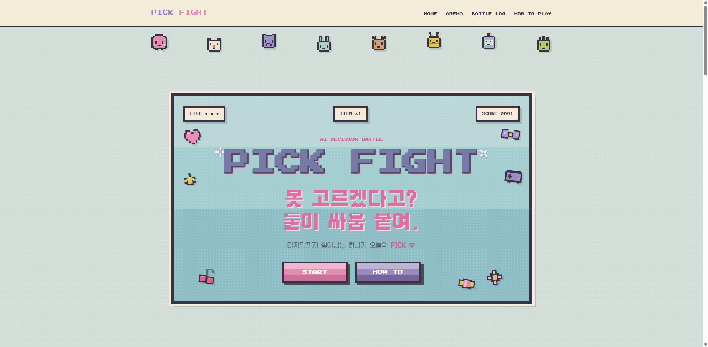

### PLAYER & CHARACTER SELECT

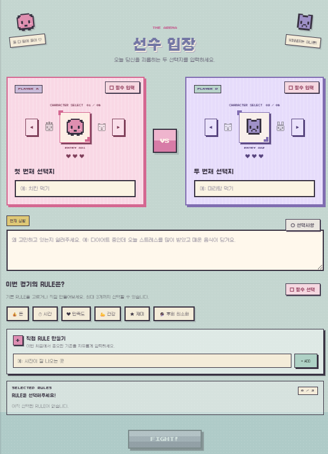

### RULE SETUP

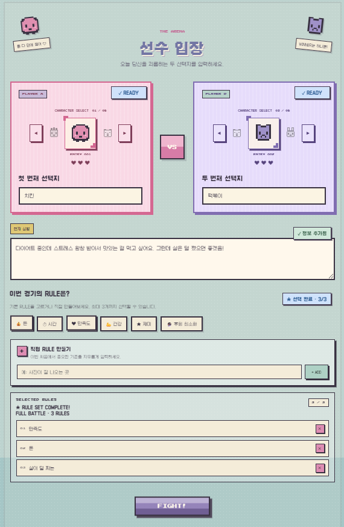

### ENTRY

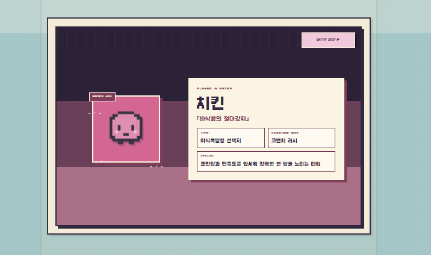

### VS

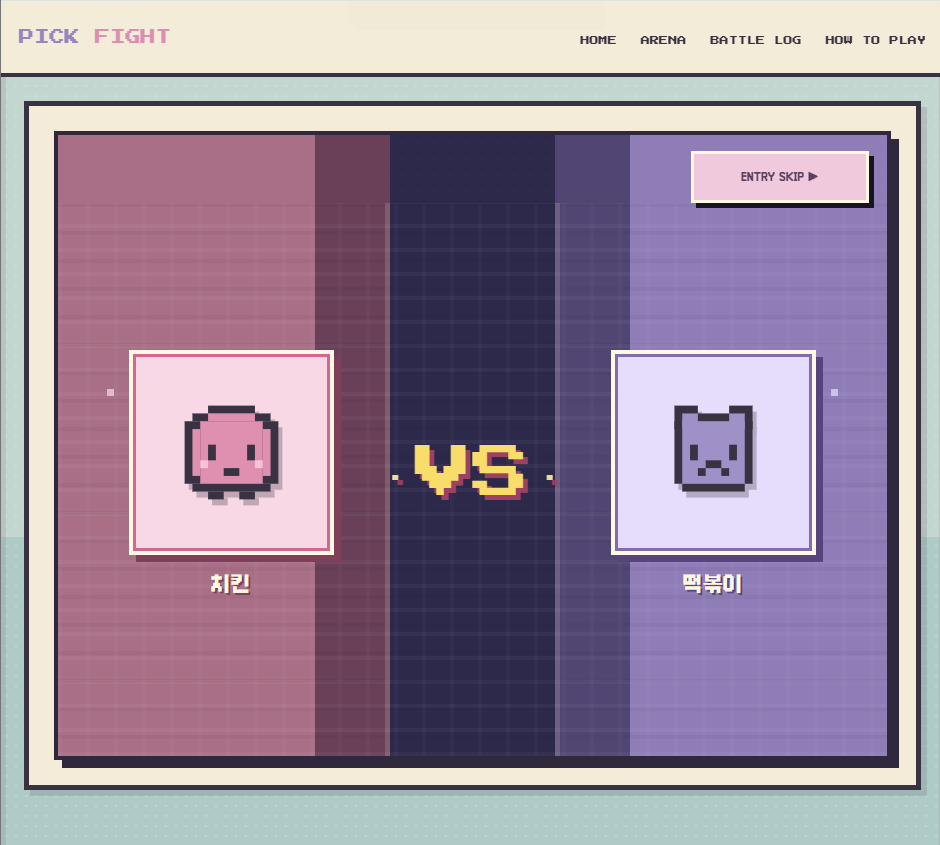

### AI JUDGE

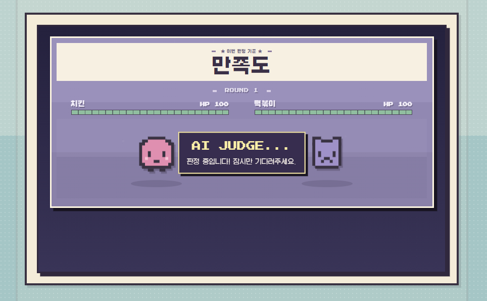

### BATTLE ROUND

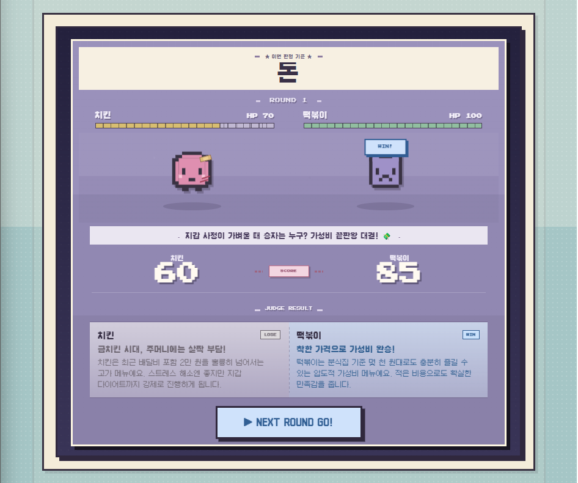

### FINAL ROUND CHOICE

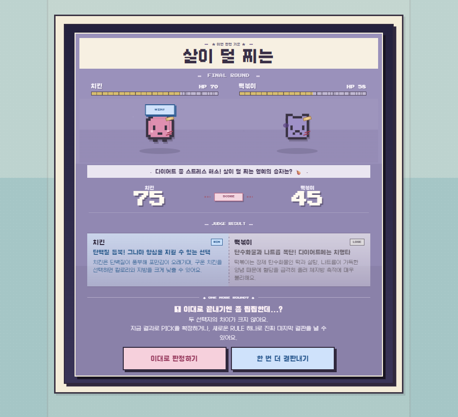

### SUDDEN DEATH

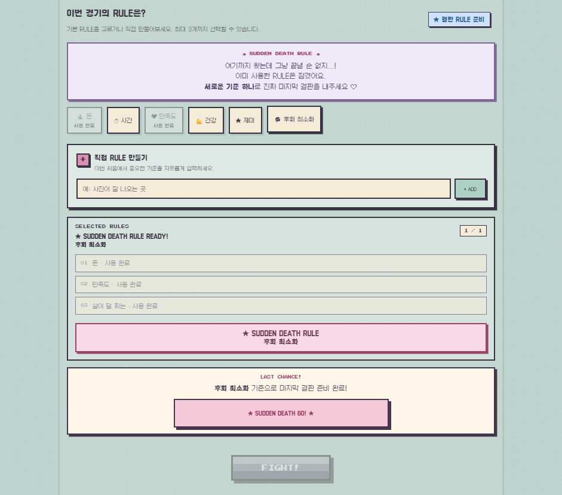

### MATCH RESULT

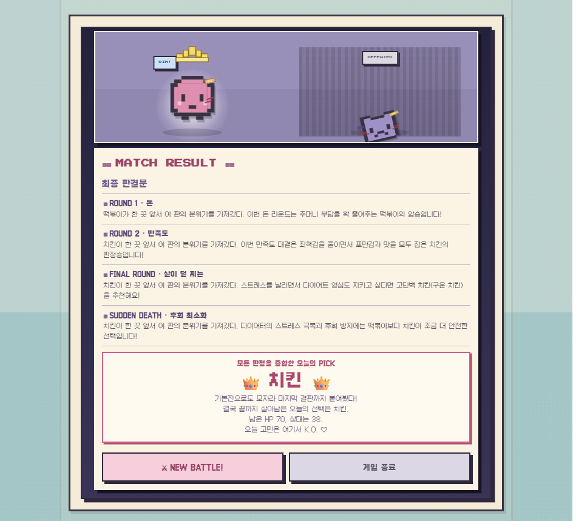

### BATTLE LOG — CARD VIEW

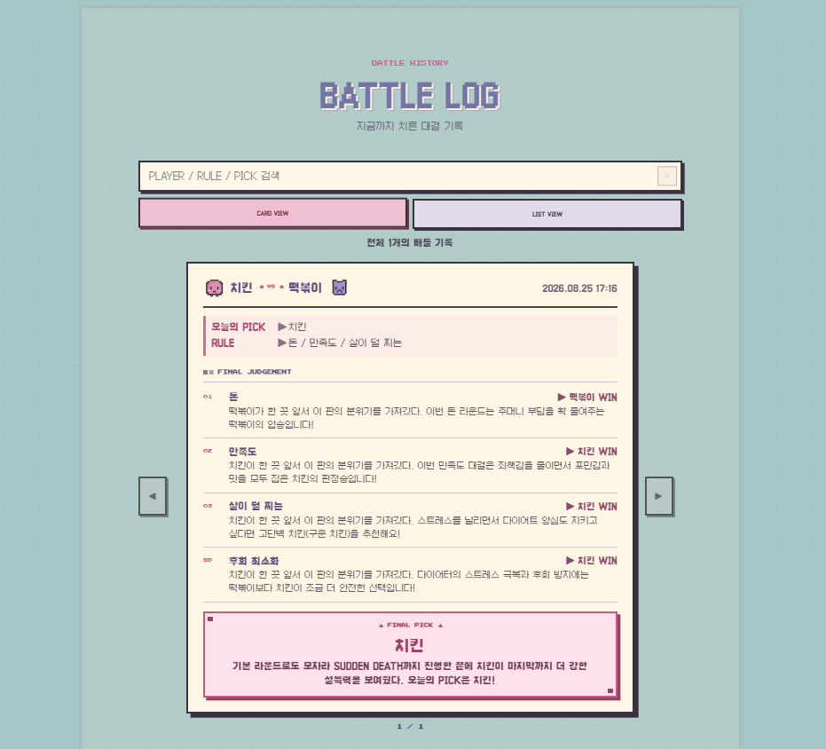

### BATTLE LOG — LIST VIEW

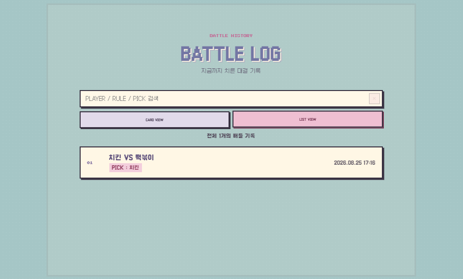

### GITHUB / DEPLOYMENT

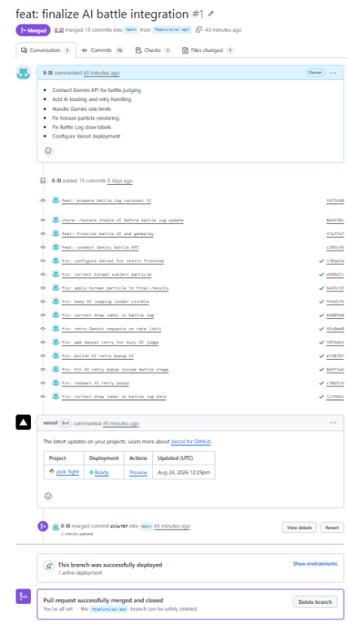

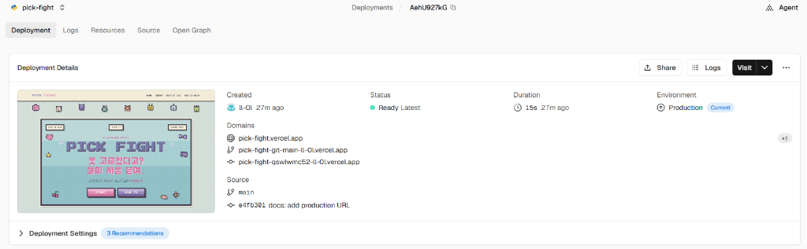

### AI BUSY / RETRY

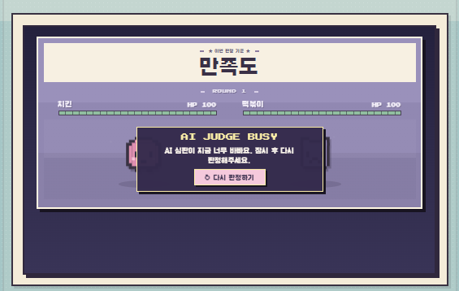

### MOBILE

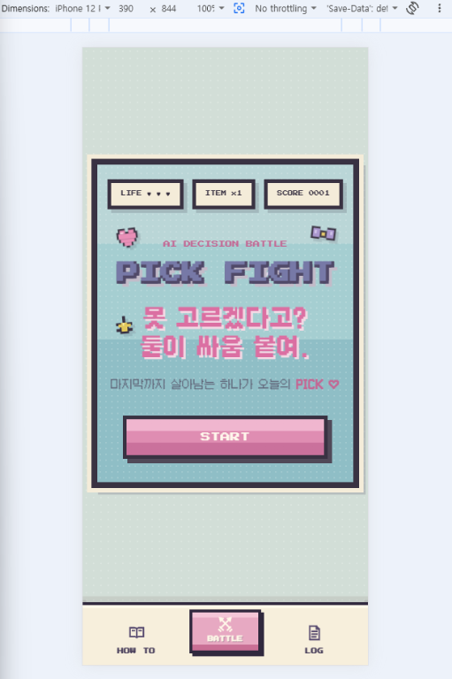

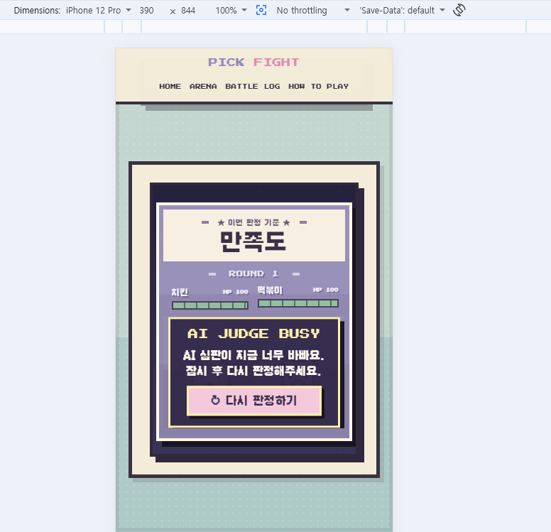

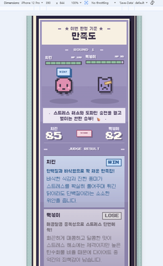

### localStorage PERSISTENCE

새로고침 전후에도 동일한 Battle Log가 유지되는 것을 확인했습니다.

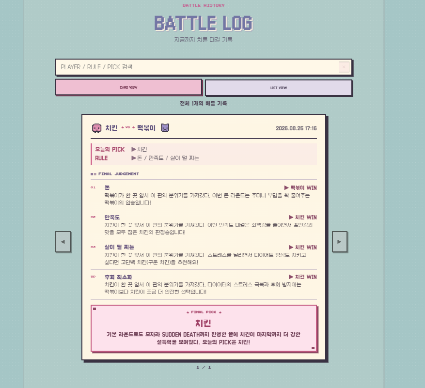


---

## 보너스 기능

### 1. Battle Log 영속화

완료된 배틀 기록을 `localStorage`에 저장하여 새로고침 후에도 Battle Log가 유지됩니다.

- 최근 최대 50개 기록 저장
- CARD VIEW / LIST VIEW 모두 저장된 데이터 사용
- 새로고침 전후 동일 기록 유지 확인

### 2. UX / 마이크로 인터랙션

- 캐릭터 캐러셀
- 입력 상태 변화
- ENTRY / VS / 카운트다운 연출
- 공격 / 피격 / HP 애니메이션
- AI JUDGE 로딩 및 BUSY 재시도
- 모바일 전투 집중형 전체 화면
- 모바일 하단 네비게이션

---

## 26. 프로젝트 특징

PICK FIGHT는 단순한 AI 추천 서비스가 아니라 AI 의사결정 과정을 게임 UI와 결합했다는 점을 핵심으로 합니다.

사용자는 결과만 받는 것이 아니라:

- 직접 캐릭터를 선택하고
- 비교 기준을 설정하고
- AI의 판단 이유를 확인하고
- 점수 차이에 따른 실제 전투를 경험하고
- 최종 기록을 Battle Log에서 확인합니다.

이를 통해 일상적인 선택 과정을 보다 재미있고 몰입감 있게 만들었습니다.

---

## 27. 향후 개선 가능 사항

- 사용자별 기록 관리
- AI 모델 선택 기능
- 사용자 지정 캐릭터
- 공유 가능한 결과 이미지
- Gemini API Rate Limit 모니터링 강화

---

## Developer

PICK FIGHT  
AI Decision Battle Web Service
